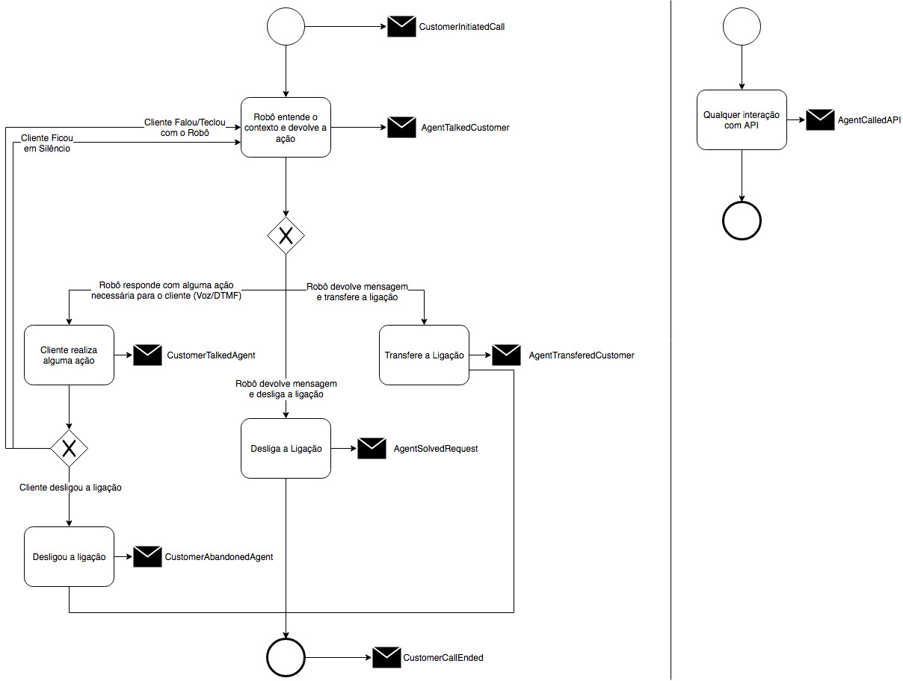

# Eventos do VDA

### Evento

Consideramos como evento um fato, portanto algo ocorrido no passado, que altera o estado de um determinado sujeito que
 sofreu uma ação.
Usamos o modelo de evento para nos ajudar a construir uma sequência de fatos que formam o contexto deste sujeito.

De forma geral um evento possui um identificador único, foi gerado através de algum canal que conseguimos monitorar, em
 um determinado ponto do tempo, possuindo um tipo determinado e podendo ou não estar relacionado com outros eventos do
 mesmo ou de outro tipo. Também é possível acompanhar a evolução de um evento. Para que este evento seja mais relevante 
 para analises ele também possui um contexto que deve ser modelado de acordo com as necessidades conhecidas daquele
 negócio.
 
#### Formato básico de um evento

```
{
  "id": "57c3b262-ff22-406e-83e8-7f54e9519dd3",
  "through": "vda-vivo",
  "when": "2018-04-24T11:05:50Z",
  "eventType": "CustomerTalkedAgent",
  "version": 1,
  "correlationId": "57c3b262-ff22-406e-83e8-7f54e9519dd3",
  "context": {
    ...
  },
}
```

### Ciclo de geração de eventos do VDA

Costumamos usar como base o ciclo abaixo de eventos para o VDA (mas é possível que existam eventos customizados para
 tratar coisas específicas):



### Indicadores que pretendemos extrair com os eventos acima

#### TMA
Usar as informações **when** dos eventos **CustomerInitiatedCall** e **CustomerCallEnded** para calcular o TMVDA,
 somar todos os valores do dia e tirar a média.

#### FCR
Usar os dados do contexto do cliente do evento **AgentSolvedRequest**, mais especificamente 
 **context.customer.identifiers[0].value** e **context.agent.solution.lastSolution**, filtrando pelas últimas 24 horas
 usando o campo **when** para calcular a taxa de FCR. Sempre que existir soluções duplicadas para o mesmo
 **.customer.identifiers[0].value** deve-se afetar a taxa de FCR.

*******************
#### Volume de Interações
> DÚVIDA!!! =>Contar o total de eventos do tipo **CustomerInitiatedCall** que possuem ao menos um evento do tipo
 **AgentTalkedCustomer** associado para totalizar o volume de interações.
*******************

#### Rechamadas
Sempre que houver mais de 1 evento do tipo **CustomerInitiatedCall** para o mesmo
 **context.customer.identifiers[0].value** dentro dos períodos pré-determinados (24hs, 7D, 28D) deve-se adicionar 1 ao
 contador de rechamadas.

#### % das chamadas atendidas pelo Robô que foram transferidas para o atendimento humano
Total dos eventos **AgentTransferedCustomer** dividido pelo total de **CustomerInitiatedCall** multiplicado por 100
 [(AgentTransferedCustomer / CustomerInitiatedCall) * 100]

#### Consumo de APIs
> DEFINIR ESTE EVENTO: Contagem dos eventos **AgentCalledAPI** agrupado pelo dado do contexto **apiAlias**

#### IDK do robô
Contagem da intenção **context.customer.nlp.intent=None** e diálogos do tipo **context.agent.dialogType=REJ** retornados
 nos eventos de **AgentTalkedCustomer**.

#### % de desambiguação
Contagem da intenção **context.customer.nlp.intent=None** e diálogos do tipo *context.agent.dialogType=REJ* retornados
 nos eventos de **AgentTalkedCustomer** somado com a contagem dos diálogos do tipo *context.agent.dialogType=DES*
 dividido pela quantidade total de eventos do tipo **AgentTalkedCustomer** multiplicado por 100
 [((AgentTalkedCustomer(None) + AgentTalkedCustomer(Consumo do que)) / AgentTalkedCustomer) * 100]

#### Acurácia do robô (Mutant)
Inicialmente este relatório será calculado manualmente após os treinamentos das intenções.

#### Acurácia do STT/TTS
Inicialmente este ralatório será calculado manualmente. Exige que um trabalho manual seja feito para escutar e
 transcrever as ligações.

#### Relatório da URA de qualidade com a visão do Cognitivo
> Este ponto ainda não está formalmente definido. O que foi sugerido é que nós fizéssemos a implementação da avaliação
 do robô dentro do próprio robô.

> No cenário descrito no Charter só TI conseguiria desenvolver o dashboard. Segue parte do charter abaixo.

> Relatório da URA de qualidade com a visão do Cognitivo; (Mutant)
- Detalhe: Entende-se que a URA de qualidade continuará com duas perguntas, uma de atendimento humano e outra de
 atendimento eletrônico, e o Robô será avaliado na nota de atendimento eletrônico. Necessário incluir uma marcação de
 que a chamada passou pelo robô.
- Cenário 1: Jornada URA; Robô – Somente pergunta de atendimento eletrônico.
- Cenário 2: Jornada URA; Robô; Humano – Abertura das duas perguntas, atendimento eletrônico e atendimento humano.

### Dicionário de Dados

#### Definições Gerais (se repete em todos os eventos)

- **id**: Identificador único do evento (gerado automaticamente), UUID
- **eventType**: Define o tipo do evento a ser tratado, string
- **version**: Define a versão do evento, integer
- **when**: Informa a hora do disparo do evento para a API usando o formato ISO-8601, string
- **through**: Informa de qual infra-estrutura o evento está sendo executado, string
- **correlationId**: Id que relaciona uma sequencia de eventos (nesse caso essa informação é o ConnId da URA), string
- **context**: Todas as informações de contexto do evento estarão contidas nessa seção do Json, object

#### Definições específicas do contexto Vivo

- **context.customer**: Todas as informações relacionadas a cliente estarão nesta seção do Json, object
- **context.customer.identifiers[0].key**: Chave com o idenfiticador que será usado neste projeto (MSISDN). Terá
 valor fixo "phone", string
- **context.customer.identifiers[0].value**: Chave com o valor do telefone que nós receberemos como parâmetro, string
- **context.customer.capturedText**: Texto enviado para o inicio a conversação, string
- **context.customer.listenedDataUsage**: Se o mesmo já ouviu alguma informação sobre o consumo de dados na URA, boolean
- **context.customer.reason**: Domínio de informação sobre a razão do desligamento [CustomerAbandonedAgent,
 AgentSolvedRequest, AgentTransferedCustomer], string
- **context.customer.nlp**: Todas as informações relacionadas ao processamento de linguagem natural, string
- **context.customer.nlp.intent**: Intenção associada ao "capturedText" do cliente, string
- **context.customer.nlp.score**: Grau de confiança associada a intenção, string
- **context.customer.nlp.realResponse**: Resposta retornada pelo LUIS antes de qualquer tratativa de rejeição, object
- **context.customer.nlp.realResponse.topScoringIntent**: Resposta que o LUIS acredita ser a correta, objeto
- **context.customer.nlp.realResponse.topScoringIntent.intent**: Intenção associada ao "capturedText" do cliente,
 string
- **context.customer.nlp.realResponse.topScoringIntent.score**: Grau de confiança associada a intenção, string
- **context.customer.nlp.realResponse.intents**: Array que contém as outras possibilidades de classificação do LUIS,
 array
- **context.customer.nlp.realResponse.intents[0].intent**: Intenção associada ao "capturedText" do cliente, string
- **context.customer.nlp.realResponse.intents[0].score**: Grau de confiança associada a intenção, string

- **context.agent**: Todas as informações relacionadas ao Agente Conversacional (robô) estarão nesta seção do Json,
 object
- **context.agent.text**: Texto que representa o que será falado através dos comandos, string
- **context.agent.command**: TwiML com as instruções a serem executadas pela URA, string
- **context.agent.dialogType**: Domínio com o tipo de diálogo que será executado, **Completar com o domínio inteiro**
 [REJ, SIL, DES], string
- **context.agent.solution**: Agrupa as informações das soluções ocorridas nesta conversação, object
- **context.agent.solution.lastSolution**: Última solução que o cliente aceitou como válida, string
- **context.agent.solution.previousSolutions**: Lista das soluções que o cliente aceitou como válida, array
- **context.agent.solution.previousSolutions[0]**: Uma das soluções que o cliente aceitou como válida, string

*********************************************

Definições Específicas (CustomerInitiatedCall)

Campo                                    | Obrigatório | Tamanho (bytes) | Domínio
-----------------------------------------|:-----------:|----------------:|:------------: 
id                                       | Sim         | 36              | UUID
eventType                                | Sim         | 21              | --
version                                  | Sim         | 1               | --
when                                     | Sim         | 30              | ISO-8601
through                                  | Sim         | 20              | --
correlationId                            | Sim         | 36              | UUID
context                                  | Sim         | --              | --
context.customer                         | Sim         | --              | --
context.customer.identifiers[0].key      | Sim         | 5               | [phone]
context.customer.identifiers[0].value    | Sim         | 15              | MSISDN
context.customer.capturedText            | Sim         | 18              | --
context.customer.listenedDataUsage       | Sim         | 1               | true/false

```
{
  "id": "f1a02020-285e-4011-ad68-02819f9fe33c"
  "eventType": "CustomerInitiatedCall",
  "version": 1
  "when": "2018-06-13T21:35:44.088Z",
  "through": "vda-vivo",
  "correlationId": "c3437779-9835-4f44-be96-97a2535c75f3",
  "context": {
    "customer": {
      "identifiers": [
        {
          "key": "phone",
          "value": "11968322333"
        }
      ],
      "capturedText": "start_conversation",
      "listenedDataUsage": true
    }
  }
}
```

*********************************************

Definições Específicas (AgentTalkedCustomer)

```
{
  "id": "f1a02020-285e-4011-ad68-02819f9fe33c"
  "eventType": "AgentTalkedCustomer",
  "version": 1
  "when": "2018-06-13T21:35:44.088Z",
  "through": "vda-vivo",
  "correlationId": "c3437779-9835-4f44-be96-97a2535c75f3",
  "context": {
    "agent": {
      "text": "Olá! Vamos continuar o seu atendimento por aqui. Como posso te ajudar?",
      "command": "<Response><Play loop=\"1\">file://./InvestigaAssunto_INI_RDM1.gsm</Play><Gather input=\"speech\" timeout=\"3\"></Gather><Redirect method=\"POST\">?speechResult=SILENCE_TIMEOUT</Redirect></Response>"
      "dialogType": "RDM"
    },
    "customer": {
      "identifiers": [
        {
          "key": "phone",
          "value": "11968322333"
        }
      ],
      "capturedText": "Posso falar com um atendente humano",
      "nlp": {
        "intent": "TRANSFERE",
        "score": 0.9900302
      }
    }
  }
}
```

*********************************************

Definições Específicas (CustomerTalkedAgent)

```
{
  "id": "f1a02020-285e-4011-ad68-02819f9fe33c"
  "eventType": "CustomerTalkedAgent",
  "version": 1
  "when": "2018-06-13T21:35:44.088Z",
  "through": "vda-vivo",
  "correlationId": "c3437779-9835-4f44-be96-97a2535c75f3",
  "context": {
    "customer": {
      "identifiers": [
        {
          "key": "phone",
          "value": "11968322333"
        }
      ],
      "capturedText": "Posso falar com um atendente humano",
      "nlp": {
        "intent": "TRANSFERE",
        "score": 0.9900302,
        "realResponse": {
          "topScoringIntent": {
            "intent": "CONSUMO DE INTERNET",
            "score": 0.993947566
          },
          "intents": [
            {
              "intent": "CONSUMO DE INTERNET",
              "score": 0.993947566
            },
            {
              "intent": "INTERNET",
              "score": 0.9705481
            },
            {
              "intent": "COMPARTILHA INTERNET",
              "score": 0.842576861
            }
          ]
        }
      }
    }
  }
}
```

*********************************************

Definições Específicas (AgentTransferedCustomer)

*********************************************

Definições Específicas (AgentSolvedRequest)

```
{
  "id": "f1a02020-285e-4011-ad68-02819f9fe33c"
  "eventType": "AgentSolvedRequest",
  "version": 1
  "when": "2018-06-13T21:35:44.088Z",
  "through": "vda-vivo",
  "correlationId": "c3437779-9835-4f44-be96-97a2535c75f3",
  "context": {
    "agent": {
      "solution": {
        "lastSolution": "Consumo de Internet",
        "previousSolutions": [
          "Compartilhar Internet",
          "Comprar Pacote"
        ]
      }
    },
    "customer": {
      "identifiers": [
        {
          "key": "phone",
          "value": "11968322333"
        }
      ],
      "capturedText": "Posso falar com um atendente humano",
      "nlp": {
        "intent": "TRANSFERE",
        "score": 0.9900302
      }
    }
  }
}
```

*********************************************

Definições Específicas (CustomerAbandonedAgent)

*********************************************

Definições Específicas (CustomerCallEnded)

```
{
  "id": "f1a02020-285e-4011-ad68-02819f9fe33c"
  "eventType": "CustomerCallEnded",
  "version": 1
  "when": "2018-06-13T21:35:44.088Z",
  "through": "vda-vivo",
  "correlationId": "c3437779-9835-4f44-be96-97a2535c75f3",
  "context": {
    "customer": {
      "identifiers": [
        {
          "key": "phone",
          "value": "11968322333"
        }
      ],
      "reason": "CustomerAbandonedAgent"
    }
  }
}
```

*********************************************

Definições Específicas (AgentCalledAPI)
context.customer: Todas as informações relacionadas a cliente estarão nesta seção do Json, object, obrigatório
context.agent: Todas as informações relacionadas ao Agente Conversacional (robô) estarão nesta seção do Json, object, obrigatório